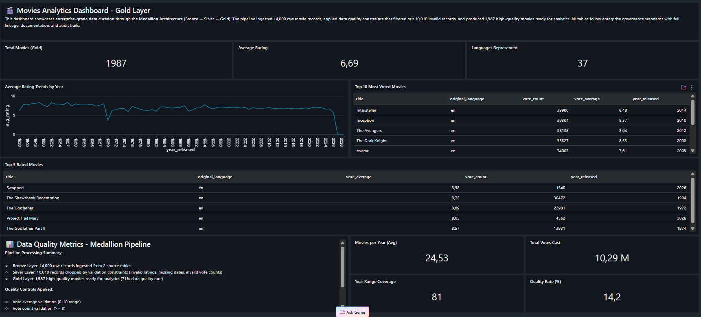

# 🎬 Movie Data Pipeline (ETL con Databricks)

## 📖 Descripción
Pipeline ETL end-to-end diseñado para procesar y analizar datos de películas. El proyecto transforma datos crudos en un modelo de datos optimizado (Estrella) para responder preguntas de negocio como: *"¿Cómo ha evolucionado el rating promedio por año?"* y *"¿Cuáles son los idiomas más predominantes?"*.

## 🛠️ Tecnologías utilizadas
- **Databricks** (Unity Catalog)
- **Apache Spark (PySpark / SQL)**
- **Delta Lake** (Almacenamiento ACID)
- **Power BI** (Visualización final)

## 🏗️ Arquitectura del Pipeline (Medallion)

| Capa | Archivo | Descripción |
| :--- | :--- | :--- |
| **Bronce** (Raw) | `bronze_movies.sql` | Ingesta de datos crudos desde archivos CSV/JSON sin transformaciones. |
| **Bronce** (Raw) | `bronze_top_rated_movies.sql` | Ingesta de dataset secundario de películas mejor calificadas. |
| **Silver** (Cleansed) | `silver_movies_cleaned.sql` | Limpieza: manejo de nulos, estandarización de formatos y filtrado de registros corruptos. |
| **Silver** (Cleansed) | `silver_top_rated_movies_cleaned.sql` | Aplicación de mismas reglas de calidad al dataset secundario. |
| **Gold** (Business) | `gold_movies_fact.sql` | Creación de la **tabla de hechos** principal con métricas listas para análisis. |
| **Gold** (Business) | `gold_movies_avg_rating_by_year.sql` | **Vista analítica**: Rating promedio agrupado por año. |
| **Gold** (Business) | `gold_movies_count_by_language.sql` | **Vista analítica**: Conteo de películas por idioma. |

## 🚀 Instrucciones de Ejecución
1. Clonar el repositorio.
2. Subir los archivos `.sql` a un workspace de Databricks.
3. Ejecutar los scripts en orden: **Bronce → Silver → Gold**.
4. Las tablas Gold están listas para ser conectadas a Power BI.

## 📊 Resultados / Dashboard

## 🔮 Mejoras futuras
- Automatizar la ingesta con **Apache Airflow**.
- Incorporar datos de la API de TMDB para enriquecer la información.
